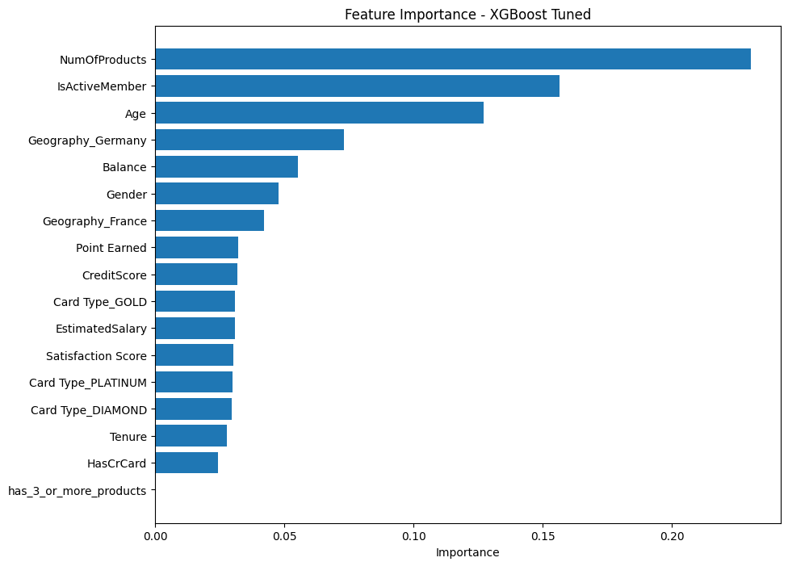

# Bank Customer Churn Prediction

**Status:** Complete (Aug 2026)

## Overview

Predicting customer churn in digital banking using classification models, with actionable business recommendations based on feature importance. The goal is to identify customers at high risk of leaving the bank, understand the key factors driving churn, and translate those insights into concrete retention strategies.

This project follows a full data analytics pipeline: exploratory data analysis, feature engineering, comparison of 10 classification models, hyperparameter tuning, feature importance analysis, and business recommendations grounded in the data.

## Data Source

This project uses the [Bank Customer Churn dataset](https://www.kaggle.com/datasets/radheshyamkollipara/bank-customer-churn) from Kaggle — 10,000 customer records from a European bank, including demographics, account activity, and engagement metrics.

**Target variable:** `Exited` (1 = churned, 0 = retained). The dataset is imbalanced, with a 20.4% churn rate.

**Note on data leakage:** the original dataset includes a `Complain` column, which was excluded from the analysis. This column is nearly perfectly correlated with churn, since it reflects behavior recorded around the time a customer left — not information available *before* the fact, and therefore not a valid predictor.

See [`data/README.md`](data/README.md) for details on obtaining the dataset.

## Approach

1. **Exploratory Data Analysis (EDA)** — examined each variable individually against churn, using crosstabs and bar charts for categorical variables, and grouped averages with boxplots for numerical variables.
2. **Feature Engineering** — encoded categorical variables (Geography, Card Type, Gender), and created a derived feature (`has_3_or_more_products`) to capture a non-linear pattern found during EDA.
3. **Train/Test Split** — 80/20 split, stratified to preserve the churn ratio in both sets.
4. **Modeling** — trained and compared 10 classification models, including hyperparameter tuning with GridSearchCV.
5. **Evaluation** — assessed models using Accuracy, Precision, Recall, F1-score, and a confusion matrix, prioritizing Recall given the business cost of missing a customer who is about to churn.
6. **Feature Importance** — extracted from the best-performing model and cross-validated against EDA findings.
7. **Business Recommendations** — translated the strongest predictors into concrete retention strategies.

## Key EDA Findings

| Variable | Signal Strength | Finding |
|---|---|---|
| **NumOfProducts** | Very strong | Non-linear pattern: 2 products → 7.6% churn (lowest), but 3 products → 82.7% and 4 products → 100% churn. Likely reflects aggressive cross-selling rather than loyalty. |
| **IsActiveMember** | Strong | Inactive members churn nearly twice as often as active members (26.9% vs 14.3%). |
| **Geography** | Strong | German customers churn at roughly double the rate of French and Spanish customers (32.4% vs ~16%). |
| **Age** | Moderate | Retained customers cluster in their 30s; churned customers cluster in their 40s–early 50s. |
| **Gender** | Moderate | Female customers churn more than male customers (25.1% vs 16.5%). |
| **Balance, CreditScore, EstimatedSalary, Tenure, HasCrCard, Satisfaction Score, Point Earned** | Weak / none | No meaningful difference between churned and retained customers. |

**Important limitation identified:** the correlation matrix showed almost no linear relationship between `NumOfProducts` and churn (-0.05), despite it being the strongest predictor found through visual EDA. This is because Pearson correlation only captures linear relationships, while `NumOfProducts` has a U-shaped, non-linear relationship with churn. This finding reinforced why variable-by-variable visual EDA is essential and shouldn't be replaced by correlation analysis alone.

## Models Compared

All models were evaluated on the same held-out test set. Since the dataset is imbalanced, class weighting (`class_weight='balanced'` or `scale_pos_weight`) was tested where applicable, and models are ranked by F1-score.

| Model | Accuracy | Precision | Recall | F1 |
|---|---|---|---|---|
| **XGBoost (Tuned via GridSearchCV)** | 0.83 | 0.57 | **0.70** | **0.63** |
| Gradient Boosting | 0.87 | 0.78 | 0.51 | 0.615 |
| Random Forest (Default) | 0.87 | 0.80 | 0.48 | 0.60 |
| XGBoost (Balanced) | 0.83 | 0.57 | 0.64 | 0.60 |
| SVM (Balanced) | 0.78 | 0.48 | 0.75 | 0.58 |
| Logistic Regression (Balanced) | 0.77 | 0.46 | 0.77 | 0.58 |
| XGBoost (Default) | 0.85 | 0.68 | 0.50 | 0.58 |
| Random Forest (Balanced) | 0.86 | 0.80 | 0.45 | 0.57 |
| Logistic Regression (Original) | 0.84 | 0.71 | 0.37 | 0.48 |
| Naive Bayes | 0.79 | 0.37 | 0.06 | 0.11 |

**Selected model: XGBoost (Tuned).** It achieved the best F1-score and the strongest Recall among the top-performing models — critical for this use case, since failing to identify a customer who is about to churn is more costly to the business than a false alarm.

**Notable observation:** `class_weight='balanced'` had a dramatic effect on Logistic Regression (Recall jumped from 37% to 77%) but a much smaller effect on tree-based models — a reminder that imbalance-handling techniques don't generalize equally across model types and should be tested, not assumed.

**Naive Bayes** performed dramatically worse than every other model, consistent with its core assumption of feature independence — an assumption clearly violated in this dataset, as shown by the correlation between `Balance` and `NumOfProducts` (-0.30) found during EDA.

### Confusion Matrix (XGBoost Tuned)

|  | Predicted: No Churn | Predicted: Churn |
|---|---|---|
| **Actual: No Churn** | 1,375 | 217 |
| **Actual: Churn** | 123 | 285 |

Of 408 customers who actually churned, the model correctly identified 285 (70%), while 123 went undetected. It also flagged 217 customers as high-risk who ultimately stayed — a reasonable trade-off, since the cost of an unnecessary retention offer is typically much lower than the cost of losing a customer with no intervention at all.

## Feature Importance



| Rank | Feature | Importance |
|---|---|---|
| 1 | NumOfProducts | 0.231 |
| 2 | IsActiveMember | 0.156 |
| 3 | Age | 0.127 |
| 4 | Geography_Germany | 0.073 |
| 5 | Balance | 0.055 |

Feature importance from the tuned XGBoost model closely aligns with the EDA findings — the top predictors match exactly the strongest signals identified earlier through crosstabs and boxplots, cross-validating the exploratory analysis.

**Interesting finding:** the derived feature `has_3_or_more_products` received zero importance. This is because XGBoost, being a non-linear model, already captures the non-linear churn pattern directly from the original `NumOfProducts` column — making the derived feature redundant. It would likely have added value for a linear model like Logistic Regression instead.

## Business Recommendations

**1. Reconsider cross-selling strategies.** The data suggests aggressive upselling beyond 2 products may correlate with dissatisfaction rather than loyalty. Consider proactive account check-ins — focused on service quality rather than additional sales — for customers who recently acquired a 3rd or 4th product.

**2. Launch re-engagement campaigns for inactive members.** Since inactivity is one of the strongest churn predictors, early intervention (e.g., after 30–60 days of inactivity) through personalized notifications or incentives could meaningfully reduce attrition before a customer disengages completely.

**3. Review product offerings for customers in their 40s–50s.** This age group may have different financial priorities than younger customers — such as mortgages, retirement planning, or wealth management. If current offerings skew toward younger, digital-first customers, tailored products or advisory services could improve retention.

**4. Investigate the German market specifically.** Churn in Germany is roughly double that of France and Spain, but the data doesn't reveal the underlying cause. A market-specific survey or focus group could help identify whether local competition, product fit, or service quality is driving this pattern before designing targeted interventions.

## Tech Stack

Python, pandas, scikit-learn, XGBoost, matplotlib, seaborn, Google Colab

## Repository Structure
```
data/         # dataset (or link to download)
notebooks/    # analysis notebook
src/          # reusable functions (if applicable)
```

## Notebook

The full analysis, including all code, visualizations, and detailed findings for each variable, is available in [`notebooks/bank_churn_prediction.ipynb`](notebooks/bank_churn_prediction.ipynb).
